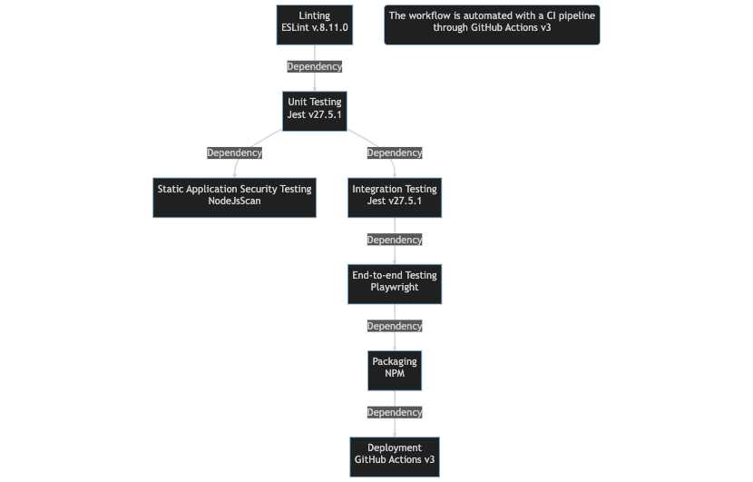

# COSC2759 Assignment 1
## Notes App - CI Pipeline
- Full Name: Yu-Cheng Lai
- Student ID: s3878874

### Guidance (remove this section before final submission)

1. Refer for assignment specification `Marking Guide` for details of what should appear in this README.

1. If you do not see an `Actions` tab in your GitHub, email patrick.conheady@rmit.edu.au with URL to your repository, so that it can be enabled.

1. Implement your CI pipeline in the directory `.github/workflows`.

1. Refer to [src/README.md](/src/README.md) for important details on building and testing the application.

1. Commit images to the `img` directory and add them like 
    ```html
    
    ```
    


# Analysis and Solution
## What's the Big Deal?

### Issue #1: No CI Pipeline
&nbsp;&nbsp;&nbsp;&nbsp;&nbsp;&nbsp;&nbsp;&nbsp;
With Alpine Inc.'s building and deployment methods and tools, the company relies on one employee's computer/machine to build and deploy all versions of the application with not enough tools and testings. These problem can grow bigger and harder to control when the employee's computer is not working properly, when the employee is not available or when malicious users try to access the application and no one knows where the vulnerabilities are. Here are some problems that can be solved with a CI pipeline using a standard devops delivery process.

### Issue #2: No Linting Tools / Code Control
&nbsp;&nbsp;&nbsp;&nbsp;&nbsp;&nbsp;&nbsp;&nbsp;
It's seen that the company has not been using proper linting tools to align the code style and thus can cause more and more bugs through time as the application grows with mashed up code styles by different developers. Linting tools can help find semantic errors in the code by forcing the developers to code with a certain code style and avoid bugs that are hard to find.

### Issue #3: No Unit Testing and Integration Testing
&nbsp;&nbsp;&nbsp;&nbsp;&nbsp;&nbsp;&nbsp;&nbsp;
Amongst the tools Alpine Inc. is using, there is no unit testing or integration testing to ensure the completeness, correctness, effectiveness, efficiency and quality of the application. Unit testing and integration testing are supposed to be done right after the application is built properly so there will be much less bug fixes and less complaints from the customers. With unit testing, the developers can be more confident about each function and reduce possible strange behaviours of all functions. On the other hand, integration testing puts functions together and test the application on a bigger scale, this assures each function can work well with other functions thus creating a correct build with as little bugs as possible. Instead of fixing problems after they happen, it's better to prevent them from happening if possible with testing tools.

### Issue #4: No Security Testing Tools
&nbsp;&nbsp;&nbsp;&nbsp;&nbsp;&nbsp;&nbsp;&nbsp;
Just by looking at the full stack development tools the company uses, there is no security testing tools at all, which could cause serious business issues if any malicious users try to break the application. Static application security testing (SAST) tools can help find security vulnerabilities in the code before the application is deployed. This could also be implemented in the CI pipeline to automate the process of protecting the company. 

### Issue #5: No End-to-End Testing
&nbsp;&nbsp;&nbsp;&nbsp;&nbsp;&nbsp;&nbsp;&nbsp;
Beyond functionality and security, one more important testing, end-to-end (E2E) testing, should be the last automated testing before deployment. After ensuring the application is bug-free and secure enough, E2E testing can be used to test the application from the users' perspective, from start-to-end, hence ensure the effectiveness and the completeness of the application. 

### Issue #6: No Packaging Process
&nbsp;&nbsp;&nbsp;&nbsp;&nbsp;&nbsp;&nbsp;&nbsp;
Last but not least, before deployment, we should note that Alpine Inc. doesn't have a packaging process for the application. Packaging is a crucial step in a delivery process since it ensures the application contains the right dependencies and configurations with the right versions and in the right environment. In the process of packaging, the company should also be able to create/generate artifacts, container images, etc. for the application to be deployed.

### Don't Worry, CI Pipeline Can Help!
&nbsp;&nbsp;&nbsp;&nbsp;&nbsp;&nbsp;&nbsp;&nbsp;
There seems to be more than one problem to solve here, but devops can handle all problems mentioned above. With the right implementation of a CI pipeline and the right developing tools and delivery processes, Alpine Inc. can save a lot of time and money and improve the quality of the application in order to grow bigger in a shorter time frame.

***

## Solution to the Problem
&nbsp;&nbsp;&nbsp;&nbsp;&nbsp;&nbsp;&nbsp;&nbsp;
To solve this problem and save Alpine Inc. from bad reputation and potential loss of clients and profits, a devops CI pipeline can be helpful. To automate the process, we will need the help from GitHub Action since the company stored the source code in GitHub. With this process, GitHub actions/checkout@v3 will be used to run our CI pipeline. Here's the pipeline  process I would recommend for Alpine Inc. to use:

### Linting: 
&nbsp;&nbsp;&nbsp;&nbsp;&nbsp;&nbsp;&nbsp;&nbsp;
It's hard to keep the code style consistent since everyone has their own habits of coding. Linting tools are used to force the developers to code with almost no semantic errors and to keep the code as clean as possible with a consistent style. Since Alpine Inc. uses Node.js as a main tool for the application, ESLint (v8.11.0) can be a great choice. ESLint is a static code analysis tool for identifying problematic patterns found in JavaScript code in order to reduce bugs and complaints. Here's how the CI pipeline runs linting with ESLint:
```yaml
name: Linting
  on: 
```

``` html

```

### Unit Testing:
&nbsp;&nbsp;&nbsp;&nbsp;&nbsp;&nbsp;&nbsp;&nbsp;
To test all functions individually and ensure that the functions/methods behave as expected, unit testing is an inevitable step. With Node.js we can easily use Jest (v27.5.1) to run unit testing as it works well with Node.js. Jest is a JavaScript testing framework designed to ensure correctness of any JavaScript codebase and can be used with other testing libraries. Here's how the CI pipeline runs unit testing with Jest:
```yaml
name: Unit Testing
  on: [push]
```
``` html

```

### Static Application Security Testing (SAST):
&nbsp;&nbsp;&nbsp;&nbsp;&nbsp;&nbsp;&nbsp;&nbsp;
Static application security testing (SAST) is a type of application security testing that analyzes application source code to find security vulnerabilities or to protect company secrets before the application is deployed. Since Alpine Inc. uses Node.js, NodeJsScan can be a great choice. NodeJsScan is a static analysis tool for Node.js applications. Here's how the CI pipeline runs SAST with NodeJsScan:
```yaml
name: SAST
  on: [push]
    branch: [main]
```
``` html

```

### Integration Testing:
&nbsp;&nbsp;&nbsp;&nbsp;&nbsp;&nbsp;&nbsp;&nbsp;
To implement integration with the company's main tool, again, Node.js, we can use Jest (v27.5.1) to run integration testing as it works well with Node.js. Jest is a JavaScript testing framework designed to ensure correctness of any JavaScript codebase. Here's how the CI pipeline runs integration testing with Jest:
```yaml
name: Integration Testing
  on: [push]
    branch: [main]
    jobs:
```
``` html

```


### End-to-End (E2E) Testing:
&nbsp;&nbsp;&nbsp;&nbsp;&nbsp;&nbsp;&nbsp;&nbsp;
Finally, it comes to the last testing phase. To do an E2E testing that simulates the real user's experience from the beginning to the end, playwright can be a great choice. Playwright is a Node.js library which is built to automate the testing of both web and mobile applications. Here's how the CI pipeline runs E2E testing with Playwright:
```yaml
name: E2E Testing
  on: [push]
    branch: [main]
    jobs:
```
``` html

```

### Packaging:
&nbsp;&nbsp;&nbsp;&nbsp;&nbsp;&nbsp;&nbsp;&nbsp;
For packaging, Node.js can be a great help since it comes with a nice package manger NPM. To package the application and produce a deployable artifact, Alpine Inc. can use GitHub Action (v3) to automate the process. With GitHub Action, Alpine Inc. can easily package the application and produce a deployable artifact. Here's how the CI pipeline runs packaging with GitHub Action:
```yaml
name: Packaging
  on: [push]
    branch: [main]
```
``` html

```

***
## Work flow of CI pipeline:



***